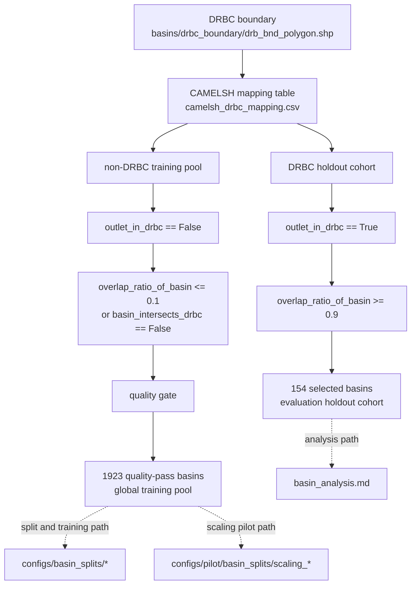
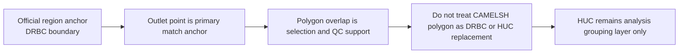

# Basin Cohort Definition

## 서술 목적

이 문서는 현재 프로젝트에서 `어떤 basin subset을 어떤 역할로 쓸 것인가`를 고정한다. 핵심은 `DRBC holdout region`, `non-DRBC training pool`, `selection rule`, `polygon 해석 원칙`, `HUC의 보조적 역할`이다.

## 다루는 범위

- DRBC holdout region과 non-DRBC training pool의 역할 구분
- selection rule과 polygon 해석 원칙
- HUC의 현재 역할
- 공식 시작점이 되는 스크립트와 기준 산출물

## 다루지 않는 범위

- basin screening score의 공식 수식
- 현재 screening 산출물의 진행 상태
- source CSV와 컬럼 사전

## 상세 서술

## 구조 개요

## 현재 공식 기준

현재 study region의 공식 경계는 `basins/drbc_boundary/drb_bnd_polygon.shp`이다. Delaware River Basin Commission 기준 Delaware River Basin을 그대로 사용한다.

현재 basin workflow는 두 층으로 나뉜다.

첫째, `DRBC holdout region`이다. 이건 최종 flood-focused 평가와 해석을 수행할 region이다.

둘째, `non-DRBC training pool`이다. 이건 모델 backbone을 학습시키는 global multi-basin pool이다. 따라서 지금은 DRBC basin을 학습 pool로 보지 않고, holdout / evaluation basin으로 본다. 즉 현재 프로젝트는 Delaware regional model을 따로 학습하는 것이 아니라, non-DRBC basin으로 학습한 global model을 DRBC에서 평가하는 구조다.

## 데이터 역할

현재 basin workflow에서 각 데이터의 역할은 아래처럼 나눈다.

- `basins/drbc_boundary/drb_bnd_polygon.shp`
  현재 공식 study region이다. 공간 포함 여부와 region 면적 계산의 기준이다.

- `basins/CAMELSH_data/attributes/attributes_gageii_BasinID.csv`
  gauge ID, gauge name, 위경도, 유역 면적 등 basin 메타데이터의 기준 테이블이다.

- `basins/CAMELSH_data/shapefiles/CAMELSH_shapefile.shp`
  CAMELSH에서 제공한 원본 basin polygon이다. 다만 HUC나 DRBC 경계와 완전히 같은 geometry라고 보면 안 된다.

- `output/basin/drbc_camelsh/camelsh_drbc_mapping.csv`
  DRBC 기준으로 CAMELSH 전체 9008 basin을 평가한 전체 매핑 테이블이다.

- `output/basin/drbc_camelsh/camelsh_drbc_selected.csv`
  현재 공식 candidate basin table이다. outlet가 DRBC 안에 있고, basin polygon overlap ratio가 `0.9` 이상인 basin만 포함한다.

- `output/basin/drbc_camelsh/camelsh_drbc_intersect_only.csv`
  polygon은 DRBC와 겹치지만 outlet는 DRBC 밖에 있는 edge case table이다. 해석 참고용이지 기본 후보군은 아니다.

- `output/basin/drbc_camelsh/drbc_camelsh_layers.gpkg`
  DRBC boundary, selected basin, selected outlet를 QGIS에서 확인하는 기본 패키지다.

- `output/basin/camelsh_training_non_drbc/camelsh_non_drbc_training_selected.csv`
  DRBC holdout region과 겹치지 않는 CAMELSH basin 중 quality gate를 통과한 global training basin 목록이다.

- `output/basin/camelsh_training_non_drbc/camelsh_non_drbc_training_summary.json`
  non-DRBC training pool의 basin 수, quality gate 기준, natural subset 수를 요약한 파일이다.

- `output/basin/checklists/camelsh_basin_master_checklist_broad.csv`
  CAMELSH 전체 9008 basin을 기준으로 `minimum quality gate`와 broad profile `usability_status`를 함께 기록한 공식 checklist다.

## 현재 selection rule

현재 selection rule은 `outlet_in_drbc == True`와 `overlap_ratio_of_basin >= 0.9`를 동시에 만족하는 CAMELSH basin이다. 이 규칙은 [`build_drbc_camelsh_tables.py`](../../scripts/build_drbc_camelsh_tables.py)에서 재현 가능하게 구현되어 있다.

현재 summary는 아래와 같다.

- CAMELSH 전체 평가 basin: `9008`
- outlet가 DRBC 안에 들어오는 basin: `192`
- 그중 overlap ratio `>= 0.9`로 최종 선택된 basin: `154`
- polygon은 DRBC와 겹치지만 outlet는 바깥인 basin: `61`

현재 DRBC basin 분석과 flood relevance screening은 이 `154개`를 기준으로 진행한다.

## non-DRBC training pool

현재 학습용 basin pool은 outlet가 DRBC 밖에 있고, polygon은 `small-overlap tolerance`를 둔 CAMELSH basin을 사용한다. 즉 basin이 training pool에 들어가려면 아래 두 조건을 동시에 만족해야 한다.

1. `outlet_in_drbc == False`
2. `overlap_ratio_of_basin <= 0.1` 또는 `basin_intersects_drbc == False`

이렇게 두는 이유는 DRBC holdout region과 공간적으로 겹치는 basin을 학습에서 원칙적으로 제거하되, CAMELSH polygon과 DRBC 경계의 source mismatch 때문에 생기는 작은 시각적 overlap은 허용하기 위해서다. 현재 tolerance는 `overlap_ratio_of_basin <= 0.1`이다.

그다음 학습용 basin에도 동일한 quality gate를 적용한다. 현재 기준으로는

- tolerant outside basin: `8800`
- 그중 quality-pass training basin: `1923`
- 그중 hydromod risk가 없는 natural training basin: `248`

이다.

현재 전체 basin checklist는 이 `minimum quality gate`를 1차 스크린으로 기록하고, 그다음 broad split 후보에 대해서만 `split-level usability gate`를 적용한다. 즉 `except`는 quality failure가 아니라, quality는 통과했지만 split 기간 안에서 target `Streamflow` 유효값이 부족해 broad prepared split에서 제외된 basin을 뜻한다.

compute 제약을 반영한 scaling pilot은 이 training pool을 `source-of-truth`로 유지하되, 실행 가능한 subset은 broad prepared split manifest를 통해 다시 잠근다. 즉 pilot의 설명 단위는 raw non-DRBC broad pool `1923`이지만, 실제 tracked subset은 broad prepared train/validation `1903` basin에서 HUC02-stratified 방식으로 뽑는다. 이건 `전국 범위 frame을 유지한 채 basin 수를 어디까지 줄일지`를 정하기 위한 운영 결정용 단계였다. 현재는 subset manifest에 핵심 static attribute를 같이 기록하고, prepared pool 대비 static distribution diagnostics, observed-flow event-response diagnostics, random same-size subset benchmark를 별도로 계산한다. pilot decision은 `300`에서 닫았고, 본 실험은 [`../../configs/pilot/basin_splits/scaling_300/`](../../configs/pilot/basin_splits/scaling_300/)을 train/validation basin file로 고정해 seed `111 / 222 / 333`의 Model 1 / Model 2에 재사용한다.

## CAMELSH polygon 해석 원칙

중요한 점은 CAMELSH polygon, HUC polygon, DRBC polygon을 같은 경계 체계로 읽으면 안 된다는 것이다. 좌표계만 맞춘다고 경계가 같아지지 않는다. 따라서 현재 프로젝트의 공간 anchor는 polygon이 아니라 `gauge outlet`이다.

현재 원칙은 아래처럼 고정한다.

1. 공식 study region은 DRBC boundary다.
2. CAMELSH basin 매칭의 기본 anchor는 outlet point다.
3. CAMELSH polygon overlap은 selection/QC용이다.
4. CAMELSH polygon을 HUC 또는 DRBC 공식 경계 대체재로 쓰지 않는다.

## HUC의 현재 역할

예전 `mostly_contained_huc10` 기반 HUC workflow는 exploratory scaffold로는 유효했지만, 현재 저장소의 공식 basin subset 정의는 아니다.

앞으로 HUC8/HUC10/HUC12는 필요할 때 아래 용도로만 사용한다.

- selected CAMELSH outlet를 HUC에 spatial join해서 basin grouping tag를 붙일 때
- basin 특성을 소유역 계층 관점에서 요약할 때
- 시각화나 설명을 위해 subregion label이 필요할 때

즉 HUC는 지금부터 `region definition`이 아니라 `analysis grouping layer`다.

## 현재 기준 스크립트

현재 기준 workflow에서 핵심 스크립트는 아래 넷이다.

- [`build_drbc_camelsh_tables.py`](../../scripts/build_drbc_camelsh_tables.py)
- [`build_drbc_camelsh_gpkg.py`](../../scripts/build_drbc_camelsh_gpkg.py)
- [`build_drbc_basin_analysis_table.py`](../../scripts/build_drbc_basin_analysis_table.py)
- [`build_camelsh_non_drbc_training_pool.py`](../../scripts/build_camelsh_non_drbc_training_pool.py)
- [`build_drbc_holdout_split_files.py`](../../scripts/build_drbc_holdout_split_files.py)
- [`../../scripts/pilot/build_scaling_pilot_splits.py`](../../scripts/pilot/build_scaling_pilot_splits.py)
- [`../../scripts/pilot/build_scaling_pilot_attribute_diagnostics.py`](../../scripts/pilot/build_scaling_pilot_attribute_diagnostics.py)
- [`../../scripts/pilot/build_scaling_pilot_event_response_diagnostics.py`](../../scripts/pilot/build_scaling_pilot_event_response_diagnostics.py)
- [`../../scripts/pilot/plot_scaling_pilot_diagnostics.py`](../../scripts/pilot/plot_scaling_pilot_diagnostics.py)
- [`../../scripts/pilot/run_deterministic_scaling_pilot.sh`](../../scripts/pilot/run_deterministic_scaling_pilot.sh)
- [`../../scripts/official/run_subset300_multiseed.sh`](../../scripts/official/run_subset300_multiseed.sh)

HUC exploratory 스크립트들은 필요하면 다시 사용할 수 있지만, 현재 basin analysis의 공식 시작점은 아니다.

## 문서 정리

현재 basin 기준은 `DRBC boundary 안에 outlet가 들어오고 polygon overlap이 0.9 이상인 CAMELSH 154 basin`을 evaluation holdout cohort로 두고, `outlet가 DRBC 밖에 있고 overlap ratio 0.1 이하까지 허용한 quality-pass CAMELSH 1923 basin`을 training pool로 두는 것이다. 현재 static basin analysis 산출물은 아래 경로에 있다.

- `output/basin/drbc_camelsh/analysis/drbc_selected_static_attributes_full.csv`
- `output/basin/drbc_camelsh/analysis/drbc_selected_basin_analysis_table.csv`
- `output/basin/drbc_camelsh/analysis/drbc_selected_basin_analysis_summary.json`

다음 작업은 DRBC holdout basin 분석 테이블 위에 forcing/streamflow 품질 정보와 event-level 지표를 붙여 flood-prone screening 단계로 넘어가는 것이다. training pool 쪽은 quality-pass 목록까지만 고정된 상태이고, broad prepared split은 여기에 `split-level usability gate`를 추가로 적용한 결과다. 따라서 이후 실험에서는 raw split count보다 checklist와 prepared split count를 기준 풀로 읽는 것이 맞다. 다만 현재 compute-constrained main comparison의 직접 실행 split은 broad prepared split 전체가 아니라, 그 prepared pool에서 고정한 `scaling_300` subset이다.

현재 split 파일도 이미 만들어져 있다.

- broad: [`drbc_holdout_train_broad.txt`](../../configs/basin_splits/drbc_holdout_train_broad.txt), [`drbc_holdout_validation_broad.txt`](../../configs/basin_splits/drbc_holdout_validation_broad.txt), [`drbc_holdout_test_drbc_quality.txt`](../../configs/basin_splits/drbc_holdout_test_drbc_quality.txt)
- natural: [`drbc_holdout_train_natural.txt`](../../configs/basin_splits/drbc_holdout_train_natural.txt), [`drbc_holdout_validation_natural.txt`](../../configs/basin_splits/drbc_holdout_validation_natural.txt), [`drbc_holdout_test_drbc_quality_natural.txt`](../../configs/basin_splits/drbc_holdout_test_drbc_quality_natural.txt)
- scaling pilot: [`../../configs/pilot/basin_splits/scaling_100/`](../../configs/pilot/basin_splits/scaling_100), [`../../configs/pilot/basin_splits/scaling_300/`](../../configs/pilot/basin_splits/scaling_300), [`../../configs/pilot/basin_splits/scaling_600/`](../../configs/pilot/basin_splits/scaling_600)

현재 broad prepared split은 [`../../data/CAMELSH_generic/drbc_holdout_broad/splits/train.txt`](../../data/CAMELSH_generic/drbc_holdout_broad/splits/train.txt), [`../../data/CAMELSH_generic/drbc_holdout_broad/splits/validation.txt`](../../data/CAMELSH_generic/drbc_holdout_broad/splits/validation.txt), [`../../data/CAMELSH_generic/drbc_holdout_broad/splits/test.txt`](../../data/CAMELSH_generic/drbc_holdout_broad/splits/test.txt)를 사용한다. 이 prepared split은 `train 720`, `validation 168`, `test 168`의 minimum valid `Streamflow` count 기준을 broad split 후보에 적용한 결과다.

현재 scaling pilot split은 broad prepared split의 test basin `38개`와 시간 구간을 그대로 유지한 채, non-DRBC broad train/validation basin만 `100 / 300 / 600` 규모로 줄인 deterministic pilot이다. tracked subset summary는 [`../../configs/pilot/basin_splits/scaling_pilot_summary.json`](../../configs/pilot/basin_splits/scaling_pilot_summary.json)에 두고, prepared pool manifest와 static attribute diagnostics는 [`../../configs/pilot/basin_splits/prepared_pool_manifest.csv`](../../configs/pilot/basin_splits/prepared_pool_manifest.csv), [`../../configs/pilot/diagnostics/attribute_distribution_scope_summary.csv`](../../configs/pilot/diagnostics/attribute_distribution_scope_summary.csv)에 둔다. observed-flow representativeness diagnostics는 [`../../configs/pilot/diagnostics/event_response/event_response_scope_summary.csv`](../../configs/pilot/diagnostics/event_response/event_response_scope_summary.csv)와 관련 CSV/JSON에 두고, random same-size subset benchmark는 [`../../configs/pilot/diagnostics/permutation_benchmark/subset300_random_benchmark_summary.csv`](../../configs/pilot/diagnostics/permutation_benchmark/subset300_random_benchmark_summary.csv)에 둔다. 현재 `scaling_300`은 event-response 기준 max absolute standardized mean difference가 `combined 0.0584`, `train 0.0567`, `validation 0.0891`로 모두 `0.10` 아래였고, random benchmark에서도 validation mismatch가 대부분의 random subset보다 작았다. 이 결과를 근거로 현재 본 실험의 고정 basin subset으로 채택했다. pilot basin 수는 DRBC test metric이 아니라 non-DRBC validation 결과와 이 diagnostics를 함께 보고 결정한다.

## 관련 문서

이 문서는 basin subset을 고정하는 문서다. 이후의 세부 작업은 아래 문서로 나뉜다.

- source CSV와 컬럼 의미는 [`basin_source_csv_guide.md`](basin_source_csv_guide.md)에서 다룬다.
- 현재 analysis table, quality table, provisional screening 결과와 다음 작업 상태는 [`basin_analysis.md`](basin_analysis.md)에서 다룬다.
- 논문 본문에서 사용할 공식 basin screening 절차와 수식은 [`basin_screening_method.md`](basin_screening_method.md)에서 다룬다.
- observed-flow 기반 event table 정의는 [`event_response_spec.md`](event_response_spec.md), event type 해석은 [`flood_generation_typing.md`](flood_generation_typing.md)에서 다룬다.
