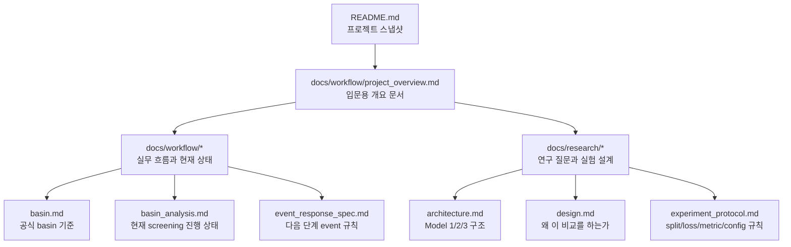
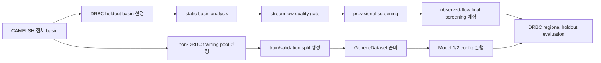

# 프로젝트 개요

## 서술 목적

이 문서는 이 저장소를 처음 접하는 독자가 `프로젝트의 목표`, `현재 workflow의 위치`, `권장 문서 읽기 순서`를 빠르게 파악하게 만드는 개요 문서다. 목적은 기존 `README.md`, `workflow/`, `research/` 문서를 대체하는 것이 아니라, 그 사이를 연결하는 입문용 설명 층을 제공하는 데 있다.

## 다루는 범위

- 프로젝트의 한 줄 요약과 연구 질문의 큰 구조
- DRBC holdout과 non-DRBC training pool의 역할 구분
- 현재 basin workflow와 모델 실행 준비 흐름의 연결 관계
- 권장 문서 읽기 순서
- 현재 완료된 단계와 다음 핵심 단계

## 다루지 않는 범위

- basin selection rule의 세부 수식과 edge case 해석
- event extraction spec의 상세 규칙
- 실험 config key, loss, metric의 전체 정의
- Model 3의 세부 구현 설계

## 상세 서술

## 한 줄 요약

현재 프로젝트는 `non-DRBC CAMELSH basin`으로 학습한 `global multi-basin LSTM`을 `DRBC Delaware basin holdout`에서 평가하면서, `deterministic -> probabilistic -> physics-guided hybrid` 순서로 extreme flood underestimation 감소를 비교하는 연구다.

## 이 저장소가 풀려는 문제

이 연구의 직접적인 문제의식은 deterministic LSTM이 극한 홍수 첨두를 체계적으로 과소추정하는 경향을 보인다는 점이다. 현재 프로젝트는 이 현상이 backbone 자체의 한계에서 오는지, 아니면 `output head` 설계와 `physics-guided structure`의 부재에서 오는지를 단계적으로 분리해 해석하려 한다.

현재 비교축은 세 단계다. Model 1은 deterministic baseline이고, Model 2는 같은 backbone 위에 quantile head를 둔 probabilistic baseline이며, Model 3는 그 위에 conceptual core를 더한 physics-guided hybrid다. 따라서 이 저장소는 단일 모델 구현 저장소라기보다, `비교 결과가 해석 가능하도록 workflow와 기준을 고정하는 연구 저장소`로 이해하는 편이 적절하다.

## 프로젝트를 한 그림으로 보기

이 문서를 읽을 때 먼저 구분해야 할 축은 두 가지다. 첫째, `workflow 문서`는 현재 실무 흐름과 산출물 상태를 다룬다. 둘째, `research 문서`는 비교의 이유와 실험 규칙을 다룬다.

## 현재 기준 데이터와 평가 구조

현재 공식 공간 기준은 `DRBC Delaware River Basin` 경계다. 다만 모델은 Delaware regional model로 학습하지 않는다. 학습은 DRBC 밖의 CAMELSH basin으로 구성한 `global training pool`에서 수행하고, DRBC는 regional holdout evaluation region으로 사용한다.

즉 현재 구조는 `DRBC 내부 basin에 특화된 지역 모델`이 아니라, `여러 basin에서 학습한 global multi-basin model이 DRBC에서 얼마나 일반화되는가`를 묻는 구조다. 이 구분을 먼저 고정해야 basin selection 문서와 split 문서에서 왜 DRBC basin이 학습에서 제외되는지 자연스럽게 이해할 수 있다.

## 현재 프로젝트를 어떻게 읽으면 되는가

이 저장소는 크게 두 갈래가 이어지는 구조다. 첫 번째 갈래는 `DRBC holdout basin을 어떻게 고르고, 어떤 basin이 flood-focused 평가에 적합한지`를 정리하는 basin workflow다. 두 번째 갈래는 `non-DRBC training pool을 어떻게 고정하고, split과 dataset을 준비해 Model 1/2를 실행할 것인지`를 정리하는 모델 실행 준비 workflow다.

현재까지 확인된 기준으로 basin 쪽은 `selection -> static analysis -> streamflow quality gate -> provisional screening`까지 진행되어 있다. 반면 model 쪽은 `training pool -> holdout split -> GenericDataset 준비 -> Model 1/2 config`까지 기본 실행 틀이 이미 마련되어 있다.

핵심은 이 둘이 아직 완전히 결합된 상태는 아니라는 점이다. 모델 실행 준비는 상당 부분 진행되었지만, 논문에서 직접적으로 주장할 `final flood-prone cohort`는 아직 observed-flow 기반 screening 이전 단계에 있다.

## 핵심 산출물과 어디서 생기는가

이 저장소를 처음 접하는 경우에는 모든 파일을 순차적으로 추적하기보다, 산출물 기준으로 workflow를 읽는 편이 더 효율적이다.

- `output/basin/drbc_camelsh/camelsh_drbc_selected.csv`
  DRBC holdout 후보 basin이 고정된 결과다.
- `output/basin/drbc_camelsh/analysis/drbc_selected_basin_analysis_table.csv`
  selected basin에 static attributes를 붙인 분석 시작점이다.
- `output/basin/drbc_camelsh/screening/drbc_streamflow_quality_table.csv`
  usable years, estimated flow 비율, boundary confidence를 반영한 quality gate 결과다.
- `output/basin/drbc_camelsh/screening/drbc_provisional_screening_table.csv`
  broad/natural cohort를 임시로 우선순위화한 provisional shortlist다.
- `output/basin/camelsh_training_non_drbc/camelsh_non_drbc_training_selected.csv`
  학습용 global training basin이 확정된 결과다.
- `configs/basin_splits/*.txt`
  broad/natural 기준의 train, validation, DRBC test split 파일이다.
- `configs/camelsh_hourly_model1_drbc_holdout_broad.yml`, `configs/camelsh_hourly_model2_drbc_holdout_broad.yml`
  Model 1 deterministic과 Model 2 quantile baseline을 바로 실행하기 위한 현재 기준 config다.

## 모델 비교를 어떻게 읽으면 되는가

이 프로젝트의 모델 비교는 `같은 backbone을 유지한 상태에서 무엇이 달라지는가`를 기준으로 읽는 것이 중요하다. Model 1과 Model 2의 차이는 주로 `head`와 `loss`에 있고, Model 2와 Model 3의 차이는 `physics-guided state/routing structure`의 추가 여부에 있다.

따라서 입문 단계에서는 “어떤 모델이 더 복잡한가”보다 “이 비교가 무엇의 효과를 분리해 보여주려 하는가”를 먼저 이해하는 편이 적절하다. 이 문서에서는 그 구조만 요약하고, 자세한 모델 구조는 `architecture.md`, 비교 의도는 `design.md`, 실행 규칙은 `experiment_protocol.md`로 연결하는 것이 현재 문서 체계에 부합한다.

## 문서 읽기 순서

이 저장소를 처음 읽는 독자에게는 아래 순서를 권장한다.

1. `README.md`
   저장소 전체 목표와 현재 workflow를 가장 짧게 파악한다.
2. `docs/workflow/project_overview.md`
   지금 읽고 있는 문서로, 문서 지도와 현재 상태를 잡는다.
3. `docs/workflow/basin.md`
   DRBC holdout과 non-DRBC training pool의 공식 기준을 고정한다.
4. `docs/workflow/basin_analysis.md`
   현재 screening workflow가 어디까지 왔는지 확인한다.
5. `docs/research/design.md`와 `docs/research/architecture.md`
   왜 이런 비교를 하는지와 세 모델의 구조 차이를 이해한다.
6. `docs/research/experiment_protocol.md`
   실제 split, loss, metric, config 규칙을 확인한다.
7. `docs/workflow/event_response_spec.md`
   다음 핵심 단계인 observed-flow event table 규칙을 본다.

## 현재 상태와 다음 단계

현재 상태를 가장 짧게 요약하면 `provisional screening + 실험 실행 기반 정비`까지는 완료된 상태다. 다시 말해 DRBC holdout basin shortlist와 non-DRBC training split, 그리고 Model 1/2 실행을 위한 기본 config는 이미 준비되어 있다.

다만 논문용으로 더 강한 주장을 하려면 아직 한 단계가 남아 있다. 다음 핵심 단계는 hourly 원시 시계열에서 `annual peaks`, `Q99-level event frequency`, `flashiness`, `event runoff coefficient` 같은 observed-flow 지표를 계산해 `event response table`과 `final screening table`을 만드는 것이다.

즉 이 저장소는 “무엇을 학습할지조차 아직 정해지지 않은 초기 상태”는 아니다. 반대로 “final basin cohort와 모델 비교가 모두 완료된 상태”도 아니다. 현재 위치는 그 중간인 `연구용 basin workflow는 상당히 정리되었고, 마지막 screening layer와 본격 실험 비교가 이어질 준비가 된 상태`로 이해하는 것이 가장 정확하다.

## 문서 정리

이 저장소를 처음 이해할 때는 세 가지를 먼저 고정하면 된다. 첫째, DRBC는 학습 지역이 아니라 holdout evaluation region이다. 둘째, non-DRBC CAMELSH basin이 global training pool을 이룬다. 셋째, 현재 프로젝트는 basin screening과 model comparison을 하나의 저장소 안에서 연결하지만, 아직 최종 observed-flow screening 이전 단계에 있다.

이 문서는 그 전체 지도를 빠르게 파악하기 위한 개요 문서다. 실제 규칙과 수식, config, 세부 해석은 아래 관련 문서에서 분리해 읽는 것이 현재 문서 체계에 맞다.

## 관련 문서

- [`../../README.md`](../../README.md): 저장소 전체 개요와 현재 workflow 스냅샷을 본다.
- [`../README.md`](../README.md): `docs/` 내부 문서 인덱스와 카테고리 구분을 본다.
- [`basin.md`](basin.md): DRBC holdout과 non-DRBC training pool의 공식 기준을 고정한다.
- [`basin_analysis.md`](basin_analysis.md): 현재 screening workflow가 어디까지 왔는지 본다.
- [`event_response_spec.md`](event_response_spec.md): 다음 단계인 observed-flow event table 규칙을 본다.
- [`../research/design.md`](../research/design.md): 연구 질문과 비교축의 이유를 본다.
- [`../research/architecture.md`](../research/architecture.md): Model 1/2/3의 구조 차이를 본다.
- [`../research/experiment_protocol.md`](../research/experiment_protocol.md): split, loss, metric, config 대응 규칙을 본다.
